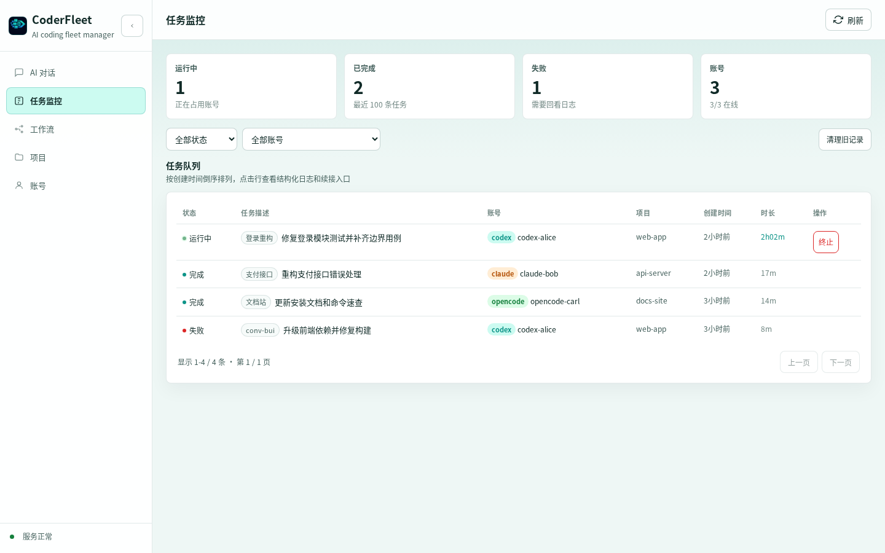
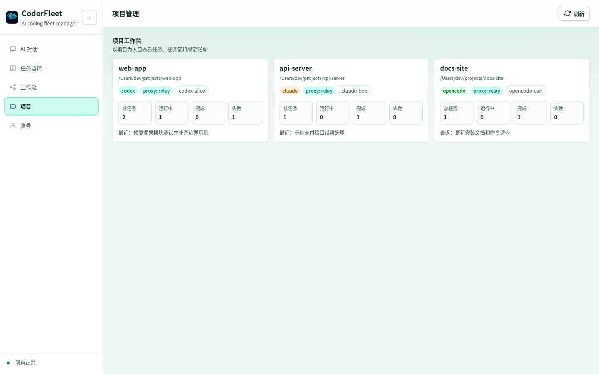
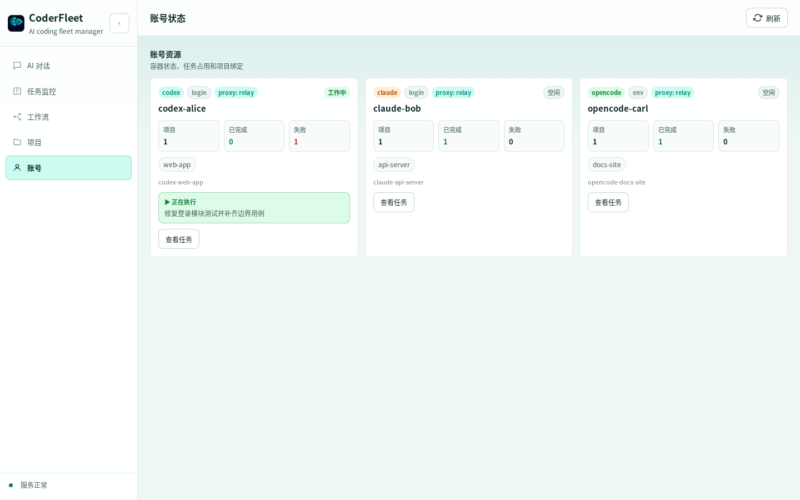

---
hide:
  - navigation
  - toc
---

<section class="cf-home" markdown>
<div class="cf-hero" markdown>
<div class="cf-copy" markdown>

<p class="cf-kicker">CoderFleet</p>

# 面向 UI 端编程的多账号 AI 开发工作台

<p class="cf-subtitle">在 Web 控制台里提交任务、跟踪日志、管理项目和账号，把 Codex CLI、Claude Code、OpenCode 和 Hermes Agent 账号组织成一套可视化开发调度系统。</p>

<div class="cf-tags">
  <span>任务监控</span>
  <span>项目工作台</span>
  <span>多账号状态</span>
  <span>容器终端</span>
</div>

<div class="cf-actions" markdown>
[快速开始](quickstart.md){ .md-button .md-button--primary }
[安装指南](install.md){ .md-button }
[查看命令](commands.md){ .md-button }
</div>

<div class="cf-install" markdown>

```bash
uv tool install coderfleet
coderfleet init
coderfleet server
```

</div>

</div>
<div class="cf-shot cf-shot-main" markdown>

</div>
</div>

## 为什么需要 CoderFleet？

在重度 AI 编程开发中，单个大模型 CLI 账号经常会遇到额度不够、限流频繁、账号切换麻烦、网络环境复杂等问题。直接购买高倍数套餐又可能成本很高，且周期内使用量未必能充分消耗。

CoderFleet 的思路是把多个普通账号组织成一个可调度的开发舰队：每个账号有独立容器、独立认证目录和独立项目挂载，任务可以从 CLI 或 Web 控制台提交，由调度服务分配给空闲账号执行。

## UI 端编程工作台

<div class="cf-shot-grid" markdown>
<figure markdown>

<figcaption>以项目为入口查看任务、任务链和绑定账号。</figcaption>
</figure>
<figure markdown>

<figcaption>统一查看账号类型、容器状态、任务占用和执行统计。</figcaption>
</figure>
</div>

## 核心能力

<div class="feature-grid" markdown>
<div class="feature-card" markdown>

### 多账号并行

同时管理 Codex、Claude Code、OpenCode、Hermes Agent 账号，减少手工切换认证目录和终端环境。

</div>
<div class="feature-card" markdown>

### 容器隔离

每个账号运行在独立 Docker 容器里，认证数据、项目目录和运行环境互不干扰。

</div>
<div class="feature-card" markdown>

### 统一代理出口

通过内部网络和 gost 中继，让需要代理的容器流量统一经过宿主机代理出口。

</div>
<div class="feature-card" markdown>

### Web 控制台

提供任务提交、日志追踪、账号状态、项目工作区和 WebSocket 终端。

</div>
<div class="feature-card" markdown>

### 异步任务调度

从宿主机提交后台任务，支持实时日志、任务终止、任务链续接和项目优先匹配。

</div>
<div class="feature-card" markdown>

### 本地优先

配置、认证和任务记录默认保存在本地工作区，适合个人开发者和小团队自托管。

</div>
</div>

## 工作方式

```text
Browser / CLI
    |
    v
CoderFleet FastAPI Scheduler
    |
    v
Docker Compose
    |
    +-- codex-alice   -> /workspace
    +-- claude-bob    -> /workspace
    +-- opencode-carl -> /workspace
    +-- hermes-dave   -> /workspace
    |
    v
proxy relay -> host proxy -> internet
```

## 下一步

新用户建议从 [快速开始](quickstart.md) 走完整流程；已经安装过的用户可以直接查看 [命令速查](commands.md) 或 [Web 控制台](server.md)。

</section>
